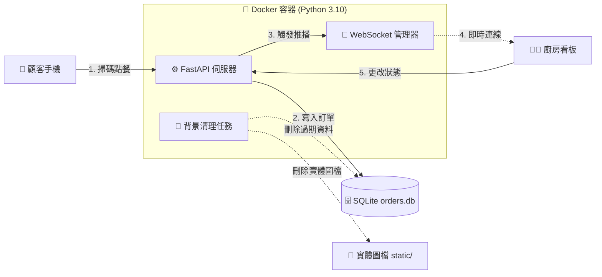
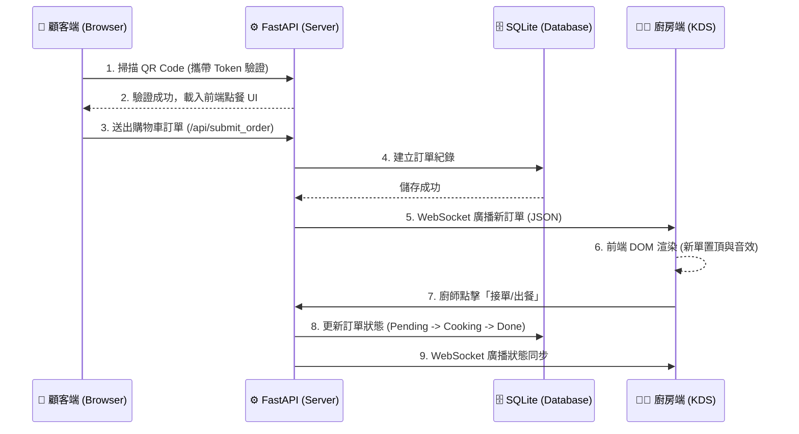

# 🍔 饗宴點餐系統與 KDS 廚房看板 (Restaurant POS & KDS)

這是一個具備現代化 UI、即時通訊與 Docker 容器化部署的餐廳點餐解決方案。專為解決傳統餐廳漏單、點餐效率低落以及硬體綁定等痛點而設計，具備從前端點餐、後端 API 處理到廚房端 WebSocket 即時推播的完整生態鏈。

---

## 🔄 系統架構與業務流程 (System Architecture & Flow)

### 1. 系統架構圖
透過 Docker 容器化隔離環境，並利用 Volume 達成資料持久化。



### 2. 核心點餐時序圖 (Sequence Diagram)
展示從顧客掃碼到廚房接單的完整生命週期與 WebSocket 互動。



---

## ✨ 核心亮點功能 (Core Features)

* **📱 掃碼點餐 (Mobile-First UI)：** 顧客掃描桌號 QR Code 即可進入網頁點餐，支援購物車增減、歷史餐點累計與即時總額計算，無須下載 App。
* **👨‍🍳 廚房即時看板 (KDS - Kitchen Display System)：** 透過 WebSocket 達成零延遲的訂單推播。具備「待接單 / 製作中 / 出餐完成」的 Kanban 狀態流轉，新訂單自動置頂，並內建斷線自動重連機制。
* **🛡️ 動態 Token 安全防護：** 每個 QR Code 皆綁定 2 小時有效期的動態加密 Token，防範惡意重複掃碼下單或外部 API 攻擊。
* **📊 營業報表系統：** 支援依「日期」動態篩選歷史訂單明細，並自動加總計算當日總營收，協助餐廳進行財務對帳。
* **🧹 背景垃圾回收 (GC Task)：** 內建 Asyncio 背景非同步任務，每 10 分鐘自動巡視並清理過期 QR Code 實體圖檔與廢棄 Token，確保伺服器硬碟空間不被佔滿。

---

## 🛠️ 技術棧 (Tech Stack)

* **Backend:** Python 3.10, FastAPI, WebSockets
* **Database:** SQLite + SQLAlchemy (ORM)
* **Frontend:** HTML5, Bootstrap 5, Vanilla JavaScript
* **DevOps / Infra:** Docker, Docker Compose, Python Logging (RotatingFileHandler)

---

## 🗄️ 資料庫設計 (Database Schema)

系統採用關聯式資料庫，主要包含以下兩張核心資料表：

1. **`active_tokens` (動態憑證表)**
   * 負責管理各桌的開桌狀態與安全驗證。
   * 欄位：`id`, `table_id` (桌號), `token` (安全金鑰), `expiry_time` (過期時間)。
2. **`order_records` (訂單紀錄表)**
   * 負責記錄所有點餐明細與廚房製作狀態。
   * 欄位：`id`, `session_seq` (當日流水號), `table_id` (桌號), `items_json` (餐點明細陣列), `total_price` (總價), `status` (狀態：pending/cooking/done), `created_at` (建立時間)。

---

## 📡 API 介面文件 (API Endpoints)

### 顧客端 (Customer API)
* `GET /order/{table_id}`：驗證 Token 並載入顧客專屬點餐頁面。
* `GET /api/my_orders`：獲取該桌當日「已送出」的餐點明細與累計總額。
* `POST /api/submit_order`：提交新訂單 (需攜帶 Table ID 與有效 Token 進行雙重驗證)。

### 廚房端 (Kitchen API & WebSocket)
* `GET /kitchen`：載入廚房看板 UI。
* `WS /ws/kitchen`：WebSocket 通道，負責伺服器與廚房看板間的雙向即時通訊。
* `GET /api/active_orders`：獲取目前未完成 (pending/cooking) 的訂單列表。
* `GET /api/history_orders?target_date={date}`：依日期獲取歷史訂單與營業報表。
* `POST /api/update_status/{order_id}`：更新訂單狀態 (接單/出餐)，並觸發 WebSocket 廣播。

---

## 🚀 快速啟動 (Quick Start)

### 1. 透過 Docker 一鍵部署 (推薦，Production-Ready)
請確保本機已安裝 Docker Desktop，接著在專案根目錄執行：
```bash
docker-compose up -d --build
```
> 系統啟動後，廚房看板將運行於：`http://localhost:8000/kitchen`

### 2. 產生桌號 QR Code
進入 Docker 容器內部執行條碼生成腳本：
```bash
docker exec -it fastapi_order_system python generate_qr.py
```
> 提示：產生的圖片會透過 Volume 掛載，自動同步至本機的 `static/` 資料夾中。

### 3. 系統日誌追蹤 (Logging)
系統會自動將日誌寫入 `system.log` (支援日誌輪替機制)。如需即時查看背景清理任務或 API 請求狀態，可使用：
```bash
docker logs -f fastapi_order_system
```

---

## 📁 專案架構 (Project Structure)
```text
/
├── main.py                # 系統進入點與 API/WebSocket 路由
├── models.py              # 資料庫 Schema 與 ORM 模型定義
├── database.py            # 資料庫連線引擎配置
├── generate_qr.py         # 動態加密 QR Code 生成腳本
├── requirements.txt       # Python 依賴套件清單
├── Dockerfile             # 容器建置藍圖
├── docker-compose.yml     # 服務編排與 Volume 掛載設定
├── templates/             # 前端 HTML 介面
│   ├── customer.html      # 顧客點餐端 UI
│   └── kitchen.html       # 廚房顯示端 UI
└── static/                # 靜態資源 (QR Code 自動生成存放處)
```
